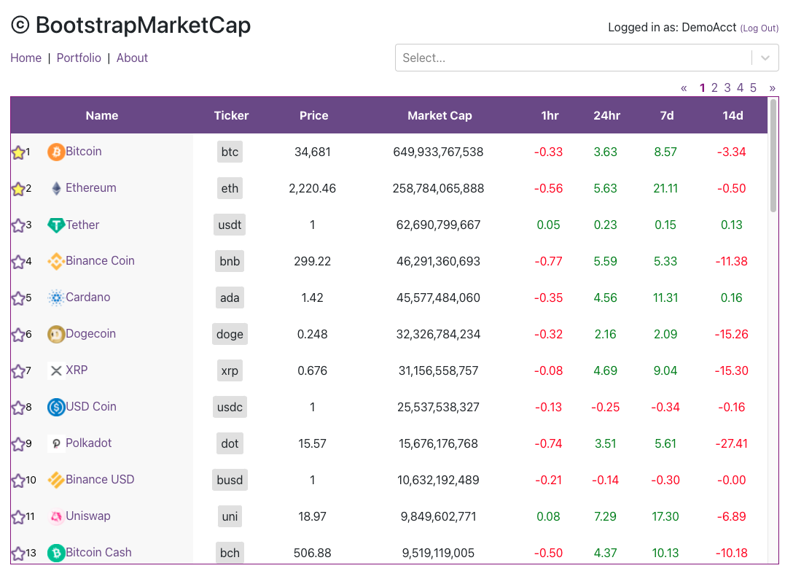
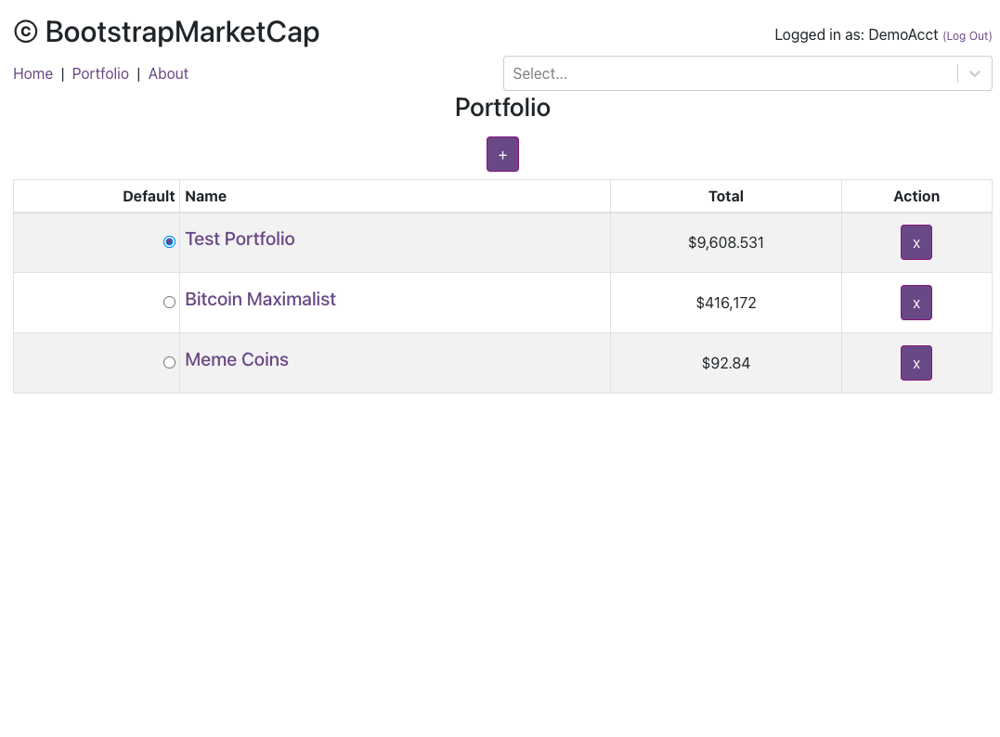
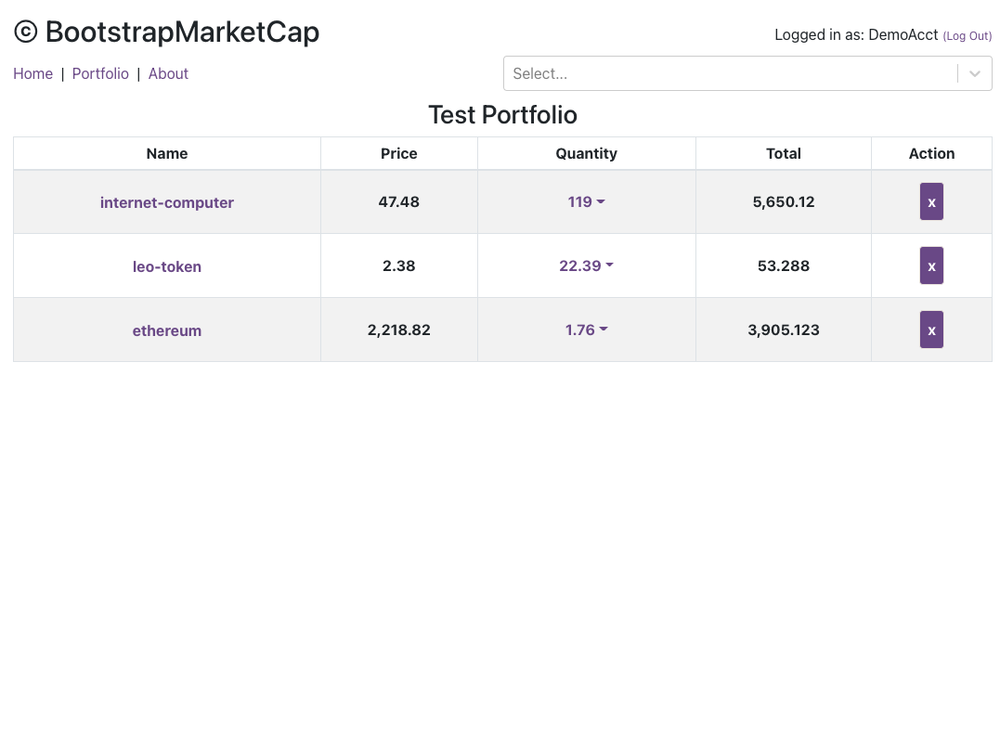
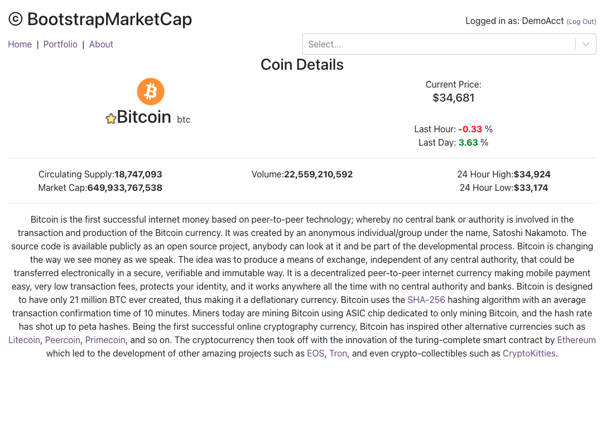

# BootstrapMarketCap

[Click here to launch app!](https://bootstrapmarketcap.herokuapp.com/)

A coin viewer and portfolio tracker

A simple and easy to use version of CoinMarketCap or CoinGecko! Lightweight and straight to the point without much in the way of adverts or distractions. Users can sign up to create and store their favorite Cryptos into a portfolio system to better track and manage their coin collection. The name (BootstrapMarketCap) is a play on the fact that the site was made primarily using bootstrap to resemble CMC!

(Plus it rhymes)

## Screenshots of the Application:

## Technologies Used:

- NodeJs, Express, Token Auth, MongoDB, Javascript, React, Css, Bootstrap
- APIs used: CoinGecko API
- Notable libraries: React-responsive, html-react-parser, React-Select

## Links:

[App Deployment](https://bootstrapmarketcap.herokuapp.com/)

[Trello Board](https://trello.com/b/OSK9KyTP/crypto-app-project2)

